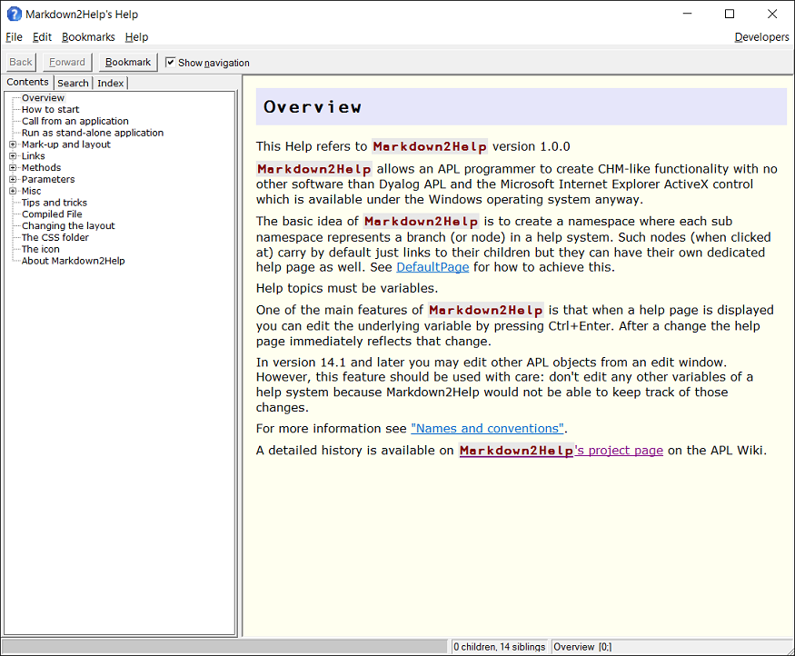
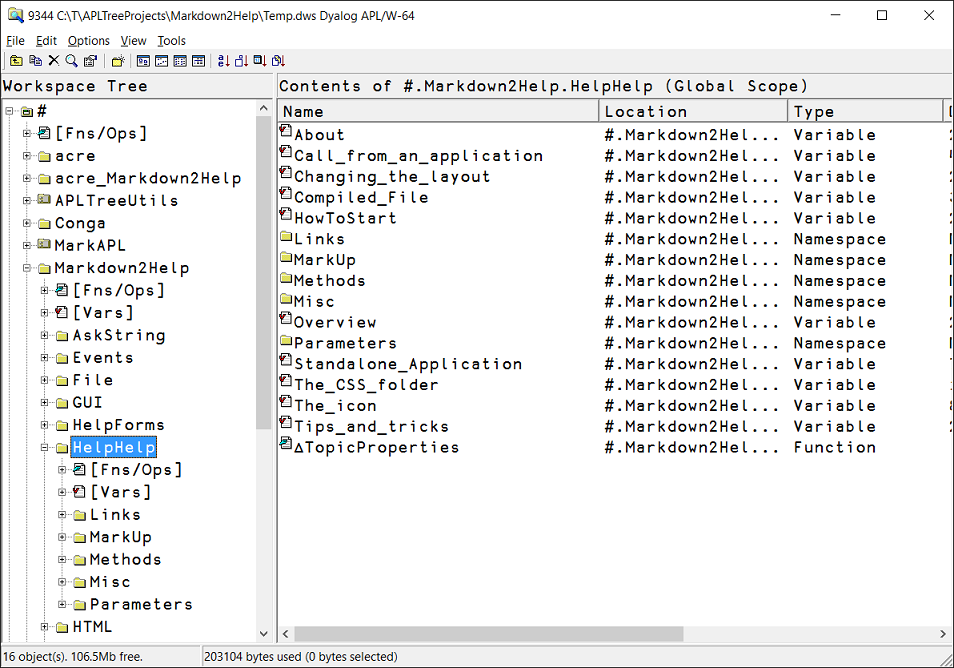
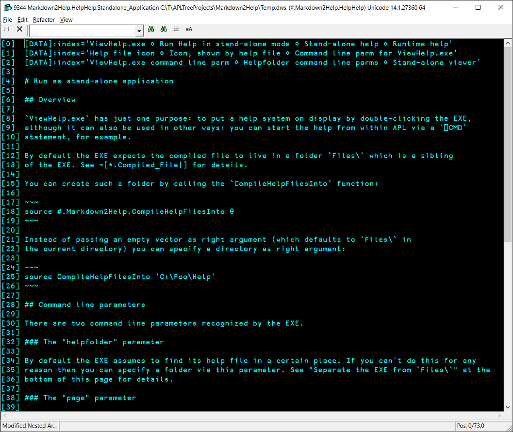

# Markdown2Help

## Overview 

This application allows you to create a CHM-like help file (including an "Index" and a "Search" tab) by creating variables that hold [Markdown](https://daringfireball.net/projects/markdown/) text defining a help page. This makes you, a Dyalog APL programmer, completely independent from any 3rd-party tools for creating and maintaining help files. 

It has the benefit of allowing you to edit your help pages while developing or tracing your application.

This is what `Markdown2Help`'s own help page looks like:



To give it a try just download `Markdown2Help`, unzip it, load it into a Dyalog session and call this function:

```
      #.Markdown2Help.Selfie 1
```

If you want to investigate `Markdown2Help`'s own help pages look into `#.Markdown2Help.HelpHelp` with the Workspace Explorer:



Note how the namespaces reflect nodes and the variables reflect help topics.

You can edit any help page by pressing Ctrl+Enter or from the context menu.

This is what a typical help variable looks like:



## How to start 

Since version version 2.2.0 there is a method `CreateStub` available that makes it easy to start a new help system. 

Just call it and provide a proper name as the right argument. If it's not supposed to live in `#` you can specify the name of the namespace it shall be created in as the left argument.

It will then create a couple of pages and a node and finally display it.

## Requirements 

`Markdown2Help` needs at least version 14.0.
