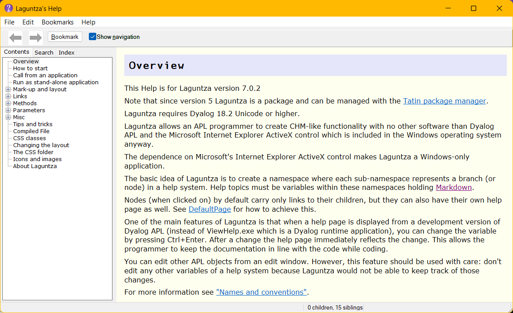
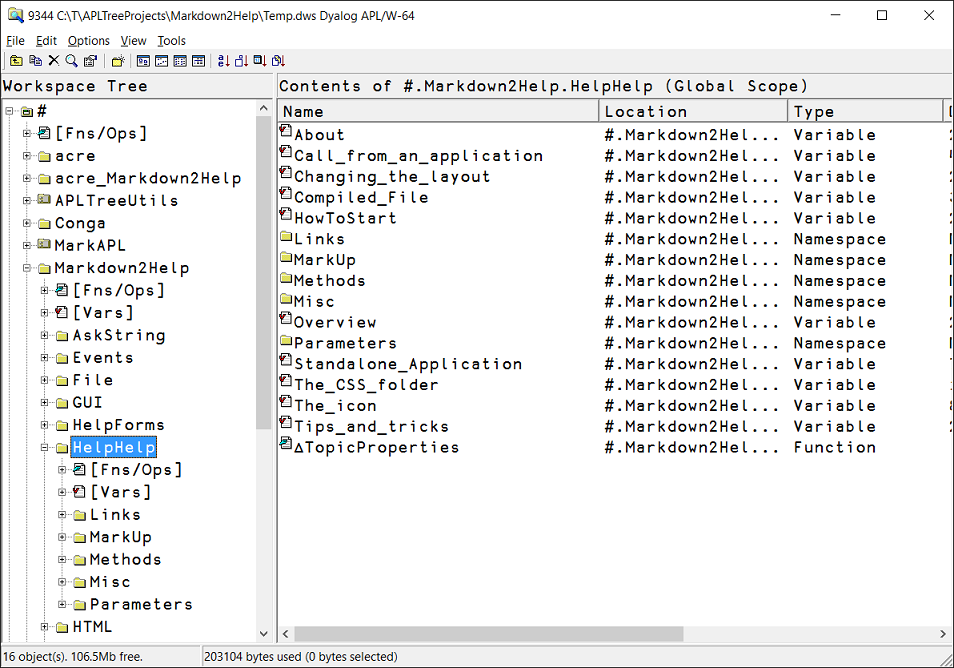

# Laguntza

_Laguntza_ means "Help" in Basque. 

Laguntza takes Markdown as input and creates a help system from it.

## Overview 

This application allows you to create a CHM-like help file (including an "Index" and a "Search" tab) by creating variables that hold [Markdown](https://daringfireball.net/projects/markdown/) text defining a help page. This makes you, a Dyalog APL programmer, completely independent from any 3rd-party tools for creating and maintaining help files. 

It has the benefit of allowing you to edit your help pages while developing or tracing your application.

This is what `Laguntza`'s own help page looks like:



To give it a try just download `Laguntza`, unzip it, load it into a Dyalog session and call this function:

```
      #.Laguntza.Selfie 1
```

If you want to investigate `Laguntza`'s own help pages look into `#.Laguntza.HelpHelp` with the Workspace Explorer:



Note how the namespaces reflect nodes and the variables reflect help topics.

You can edit any help page by pressing Ctrl+Enter or selecting "Edit Help page" from the context menu.

This is what a typical help variable looks like:


## How to start 

Since version version 2.2.0 there is a method `CreateStub` available that makes it easy to start a new help system. 

Just call it and provide a proper name as the right argument.

If the defaults do not suit you then create a parameter spaces with  

```
parms←Laguntza.CreateParms ''
```

make the amendments and pass `parms` as left argument to `CreateStub`.

`CreateStub` will create a couple of pages and a node and finally put the new help system on display.

## Requirements 

`Laguntza` needs at least Dyalog version 15.0.
