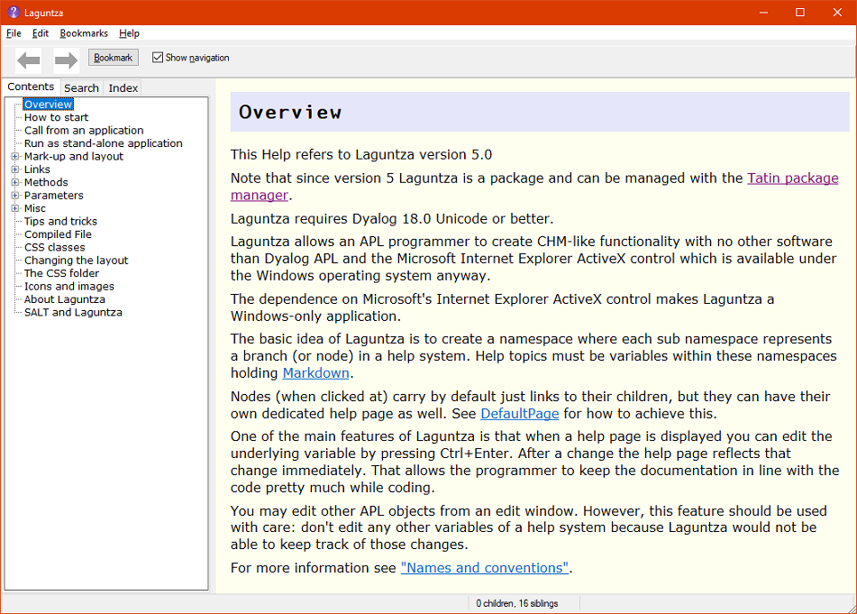
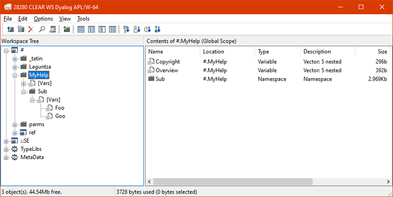
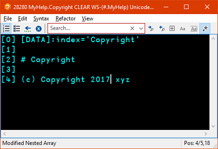

# Laguntza

_Laguntza_ means "Help" in Basque. 

Laguntza takes Markdown (in the workspace) as input and creates a help system from it.

Since version 5.0. Laguntza is a package and can be installed or loaded with the Dyalog package manager Tatin[^tatin].

## Requirements 

Since version 5.0.0 `Laguntza` needs at least Dyalog version 18.0.

It also requires the Tatin package manager.

## Overview 

Laguntza allows you to create a CHM-like help file (including an "Index" and a "Search" tab) by creating variables that hold [Markdown](https://daringfireball.net/projects/markdown/) text defining a help page. This makes you, a Dyalog APL programmer, completely independent from any 3rd-party tools for creating and maintaining help files. 

It has the benefit of allowing you to edit your help pages with the function editor while developing or tracing your application.

This is what `Laguntza`'s own help page looks like:



To give it a try execute this:

```
      ]TATIN.LoadPackage [tatin]Laguntza
```

This downloads `Laguntza` and its dependencies, unzips it and loads it into a Dyalog session. Now you can view Laguntza's own Help System with this statement:

```
      #.Laguntza.ViewLaguntzasHelp ⍬
```


## How to start 

You can create your own help system by executing these statements:

```
      parms←#.Laguntza.CreateParms ⍬  ⍝ 
      parms.homeFolder←739⌶0          ⍝ Temp directory
      ref←parms #.Laguntza.CreateStub '#.MyHelp'
```

`CreateStub` will create a couple of pages and a node and finally put the new help system on display.

`ref` is a reference pointing to the GUI. 

You may investigate this new help system with the Workspace Explorer:



Note how the namespaces reflect nodes and the variables reflect help topics.

You can edit any help page by pressing Ctrl+Enter or selecting "Edit Help page" from the context menu.

This is what a typical help variable looks like:




[^tatin]: _Tatin_ is a package manager for Dyalog APL packages;
The project lives on <https://github.com/aplteam/Tatin>; The principal Tatin server is <https://tatin.dev>